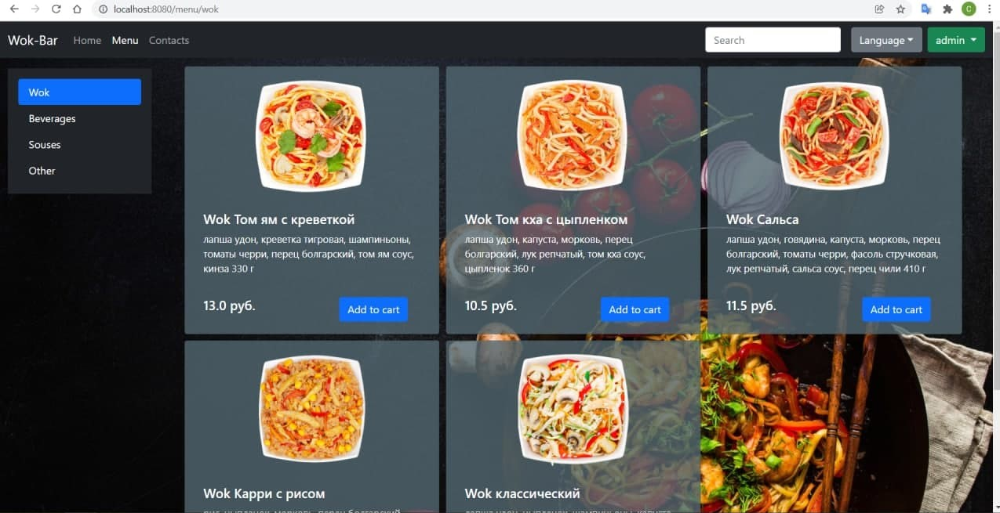
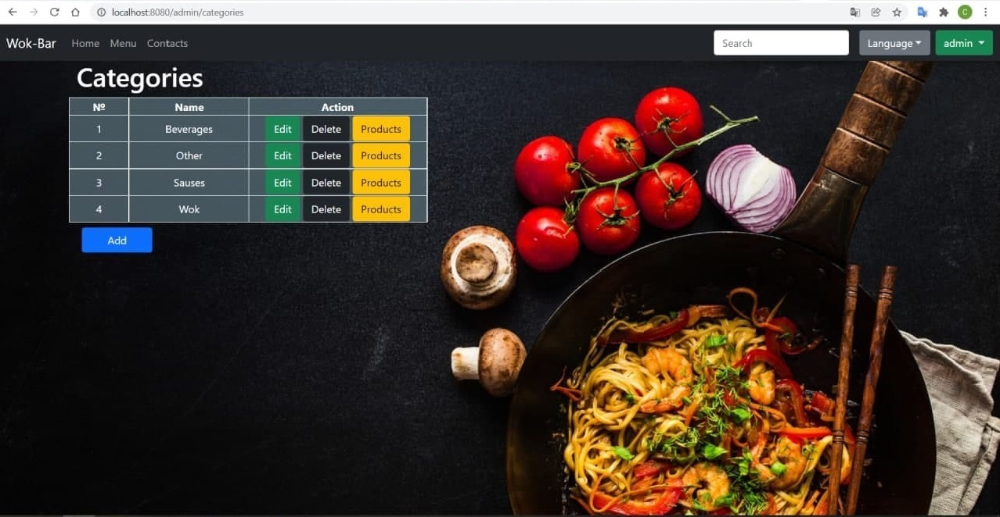
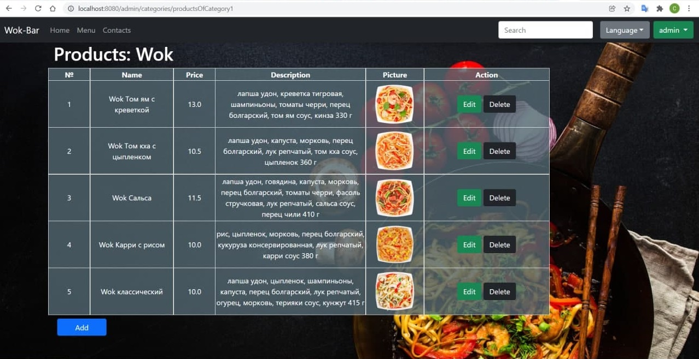
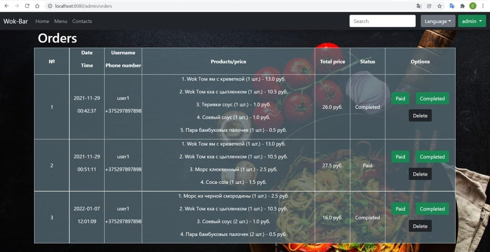
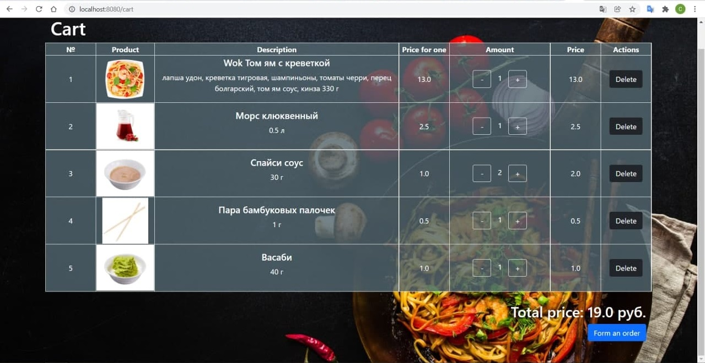

#Wok-Bar

*Graduation project of the TechMeSkills courses.*

#Wok-Bar

Also my first web-application with spring framework.

**What technologies I used on the project:** Java, SQL, 
Spring Data JPA, Spring Security, Spring Core, Spring MVC, 
Spring AOP, Hibernate, Tomcat, MySql, XML, HTML 5, CSS, 
Bootstrap, Thymeleaf, Git

**Application functionality:**
- registration and authorization forms
- data validation
- differentiation of roles and access to data of the administrator and the regular user
- menu page by category
- basket
- user page with the display of his data and his orders
- administrator's office with the ability to edit, change, delete, add, view users, product categories, products
- all data of users, categories, products are taken from the database
- localization, internationalization (English, Russian), including data from the database using the example of categories

Do not forget to include the url of the embedded database in the file: src/main/resources/application.properties. 

To use the database, use mysql, write the SQL script in the console, the 
table creation script - 
'WokBar/DB/DDL Tables.txt', filling tables - 'WokBar/DB/Base.txt'.

**DB access:** 
>login - root; password: password.

**Login / password for access to the administrator's office:**
>login = admin; password = admin.

**Login / password to access the test user account:**
>login = user1; password = user1.

Screenshots:

